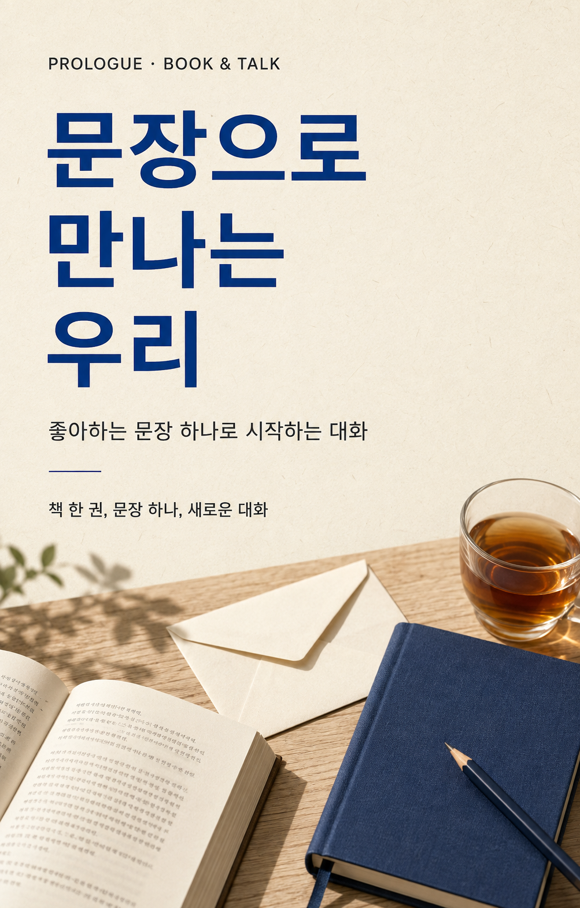

# 문장으로 만나는 우리

**상태: 등록 전 초안. 실제 모임은 아직 생성하거나 공개하지 않았습니다.**

좋아하는 문장 하나로 시작하는 8명·120분 책과 대화 모임입니다. 인원과 시간은 기획 제안이며, 사용자가 확정한 운영 조건은 아닙니다.

## 준비한 자료

- `cover.png`: 가로 사진형 커버. 앱 목록 첫 이미지로 사용합니다.
- `poster.png`: 세로 초대장. 상세 소개 또는 SNS 홍보용입니다.
- `invitation.txt`: 모임 소개 입력란에 붙여넣을 평문 원고입니다.
- `image-prompts.md`: 내장 이미지 생성 도구에 사용한 전체 프롬프트입니다.

커버와 포스터는 생성한 콘셉트 이미지이며 실제 공간이나 참석자를 촬영한 사진이 아닙니다. 다른 계정의 인스타그램 사진은 가져오지 않았습니다.

## 등록 설정 제안

| 항목 | 내용 |
|---|---|
| 이름 | 문장으로 만나는 우리 |
| 장소 | 서로서가 — 대관 및 상세 주소 확인 필요 |
| 장소 참고 | https://www.instagram.com/seoro_sg/ |
| 인원 | 참가자 8명 + 진행자 1명, 공간 수용 인원 확인 필요 |
| 소요 시간 | 120분 |
| 참가 조건 | 성인, 책과 대화에 관심 있는 누구나 |
| 성별별 정원 | 구분 없음 |
| 직장 인증 | 필수 아님 |
| 대기 정원 | 4명 제안 |
| 참가비 | 미정 — 무료로 간주하지 않음 |
| 일시 | 미정 |
| 오픈채팅 | 모임장 안내 링크 필요 |

서로서가 공개 프로필에서 양재동 책방이며 책과 다정한 관계를 지향하는 공간임을 확인했습니다(2026-09-07). 장소 운영자와의 협업·대관·음료 제공은 확인하지 않았습니다. 확정되지 않은 제휴를 나타내는 ‘서로서가 × 프롤로그’ 표현은 사용하지 않았습니다.

## 진행자 운영안

1. 도착 20분 전: 8자리와 진행자 자리 배치, 이름표·질문 카드·편지지 준비. 공간 집기 사용 범위는 대관 시 확인합니다.
2. 첫 인사: 답변을 건너뛸 수 있고 연락처 교환은 자율임을 안내합니다.
3. 문장 소개: 1인 2분을 기준으로 차례를 안내합니다. 문장을 준비하지 않은 분은 ‘요즘 나를 설명하는 한 단어’로 대체합니다.
4. 짝 대화: 15분씩 두 번. 두 번째에는 서로 다른 짝이 되도록 진행자가 안내합니다. 각자가 말할 시간을 균등하게 나눕니다.
5. 네 명 대화: 두 그룹으로 나누고 첫 질문에 한 번씩 답한 뒤 자유롭게 이어갑니다. 모르는 사연을 캐묻거나 원치 않는 조언을 하지 않도록 돕습니다.
6. 마무리: 미래의 자신에게 쓰는 편지는 각자 가져갑니다. 다른 참가자에게 편지를 전달하거나 연락처를 강제로 수집하지 않습니다.

준비물 제안: 이름표 9장, 질문 카드 8세트, 편지지·봉투 각 8장, 여분 필기구, 타이머. 음료와 간식은 제공 여부 확정 전 원고에 포함하지 않습니다.

## 등록 전에 필요한 정보

날짜·시작 시간, 참가비와 포함 내역, 최종 정원, 대관 확정 여부와 주소, 카카오 오픈채팅 링크, 로그인된 모임장 계정이 필요합니다. 유료 모집이면 취소·환불 및 최소 인원 미달 시 운영 방식도 확정해야 합니다.

현재 콘솔에는 초안 저장 기능이 없고, 생성 API가 날짜와 오픈채팅 링크를 필수로 받습니다. 임의의 날짜나 다른 모임 링크를 넣어 저장하지 않았습니다.
